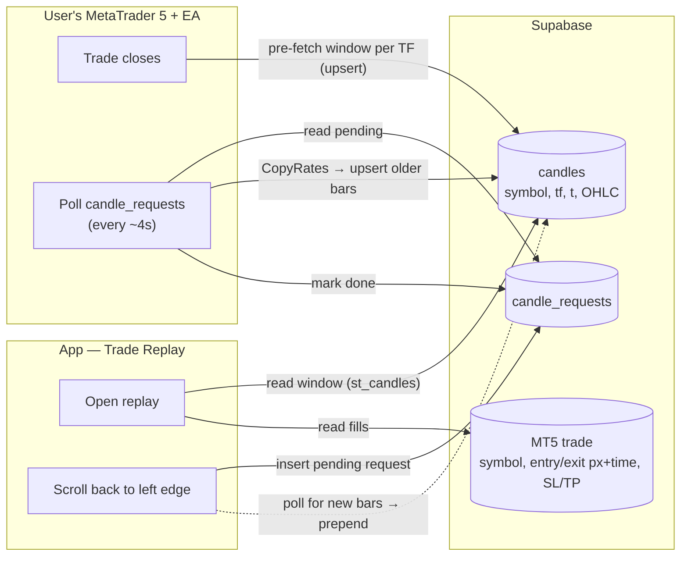

# Trade Replay — data architecture (hybrid MT5 loading)

How candles get from the user's MetaTrader 5 into the Trade Replay chart.
**Scope: MT5-synced trades only** (manual entries are out — they have no broker feed
and don't capture entry/exit price).

## The idea

Two layers so replay opens instantly *and* you can scroll back as far as your broker keeps:

1. **Pre-fetch** — when a trade closes, the EA pushes a generous window of candles
   **per timeframe** around that trade into Supabase. Replay opens immediately and
   works even if MT5 is later offline.
2. **Load more (on demand)** — when you scroll back past the pre-fetched window, the
   app asks for older candles; the EA (while running) fetches them from MT5 and
   appends. This reaches the **maximum your broker stores** without pre-storing it all.

Candles are keyed by `(symbol, tf, t)` so they're **shared across every trade of the
same symbol** — no per-trade duplication.

## Storage (see `supabase/candles_setup.sql`)

- `public.candles (symbol, tf, t, o,h,l,c)` — PK `(symbol,tf,t)`; `tf` in **minutes**
  (1, 5, 15, 60, 240, 1440). Read via `st_candles(symbol, tf, from, to)`.
- `public.candle_requests (symbol, tf, from_t, to_t, status)` — the load-more queue.
- Trade meta (symbol, entry/exit price+time, SL/TP, direction) is **already** on the
  synced MT5 trade — nothing new to store for it.

## EA responsibilities (the contract)

The EA is the only piece that touches MT5. It does two jobs. Timeframe map:
`1→PERIOD_M1, 5→M5, 15→M15, 60→H1, 240→H4, 1440→D1`.

### 1. Pre-fetch on trade close
For the closed trade's `symbol`, for each timeframe, `CopyRates` a window centred on
the trade and **upsert** each bar into `candles` (`on_conflict (symbol,tf,t)`):

| TF | lookback before entry | after exit | ≈ bars |
|----|----------------------|-----------|--------|
| M1 (1) | 1 day | 4 h | ~1,700 |
| M5 (5) | 1 week | 1 day | ~2,300 |
| M15 (15) | 2 weeks | 1 day | ~1,400 |
| H1 (60) | 3 months | 3 days | ~2,200 |
| H4 (240) | 1 year | 1 week | ~2,200 |
| D1 (1440) | 5 years | 1 month | ~1,300 |

Bar row: `{ symbol, tf, t: (int)bar_open_time_utc_seconds, o, h, l, c }`.
POST to `…/rest/v1/candles` with header `Prefer: resolution=merge-duplicates`.

### 2. On-demand "load more" (poll)
Every ~4 s while running:
1. `GET candle_requests?status=eq.pending&order=created_at.asc`
2. For each: `CopyRates(symbol, tf, from_t..to_t)`, upsert into `candles`.
3. `PATCH` the request `status` → `done` (or `empty` if the broker has nothing older,
   so the app stops waiting; `error` on failure).

> **Caveat:** load-more only works while the user's MT5 + EA are running. The
> pre-fetched window always works offline; only *deeper* history needs a live EA.

## App data layer (plugs into the existing prototype)

- **Open replay(trade):** for the current TF, `st_candles(symbol, tf, entry−window,
  exit+window)` → feed the chart. Cache loaded range per `(symbol, tf)` in memory.
- **Switch TF:** load that TF's window (already pre-fetched) — instant.
- **Scroll back to the left edge:** if `st_candles_oldest` says older bars *could*
  exist, insert a `candle_request` for the next chunk, show a subtle "loading
  history…" tag, poll `candles`, then **prepend** and keep the view stable. If the
  request goes `empty` → "start of available history"; if it never fulfils →
  "connect MT5 to load more."
- **Markers/position tool:** placed from the trade's real entry/exit price+time +
  SL/TP (already on the MT5 trade).

## Rough storage

Shared, deduped: ~11k bars per symbol across all TFs for one trade's pre-fetch, and
overlapping trades reuse the same rows. 20 symbols × ~11k ≈ 220k rows before any
load-more — trivial for Postgres. Load-more grows it only for history you actually view.
